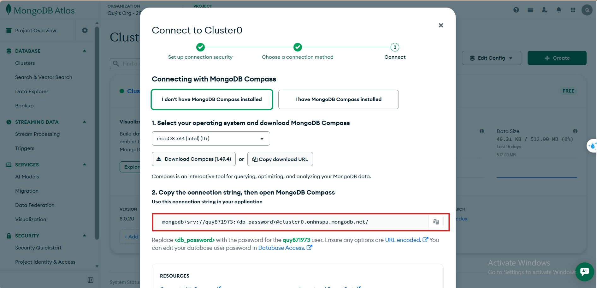
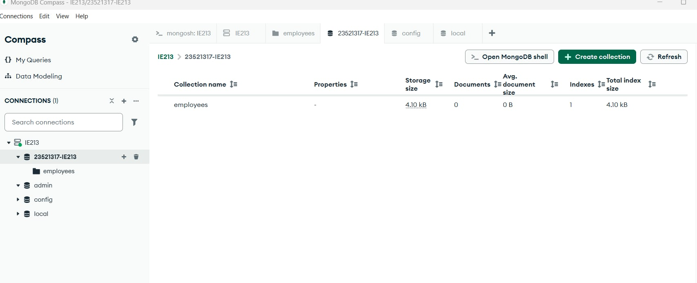
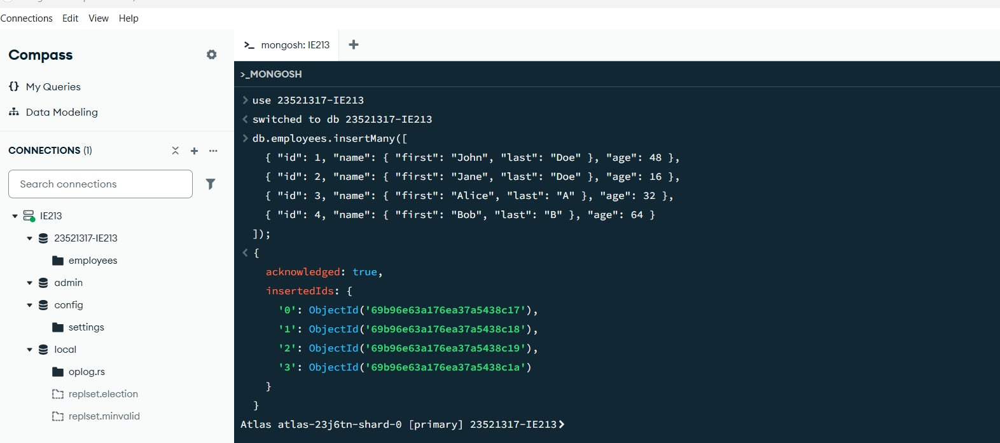
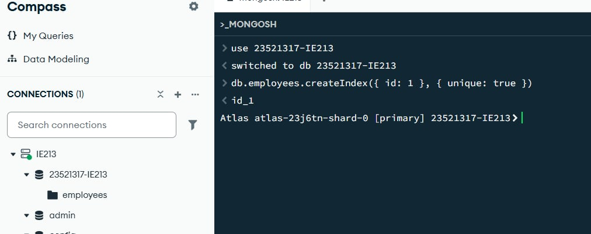
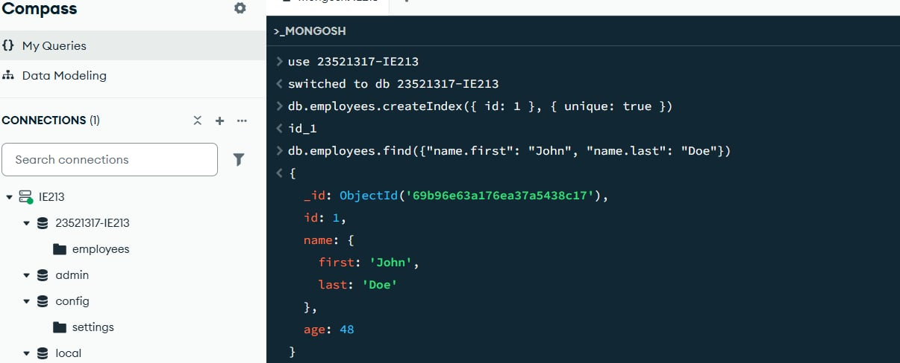
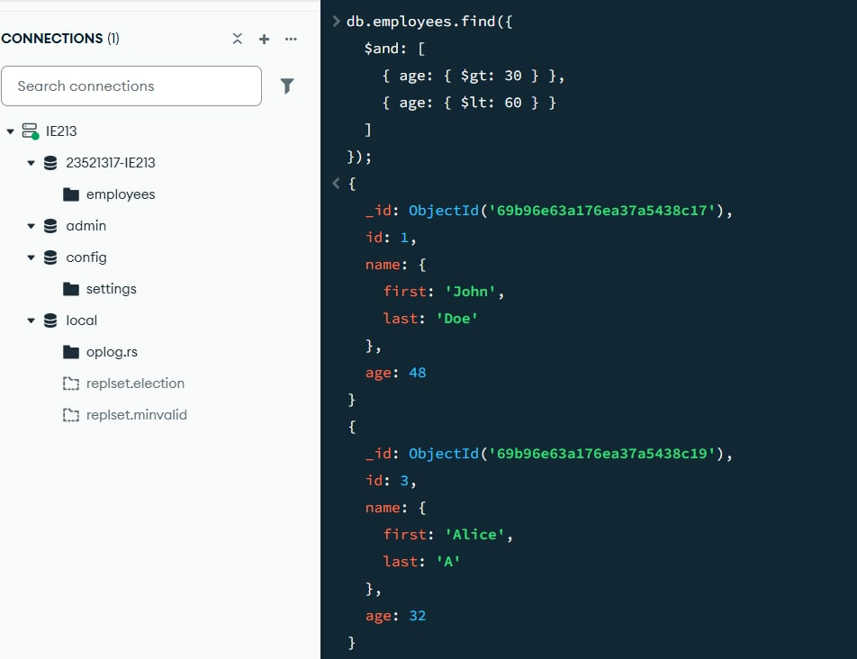
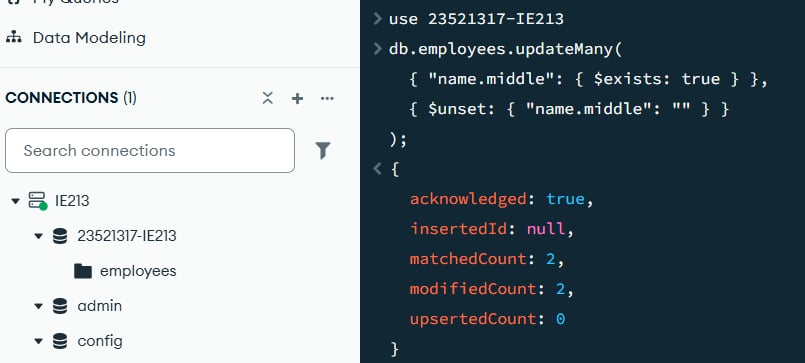
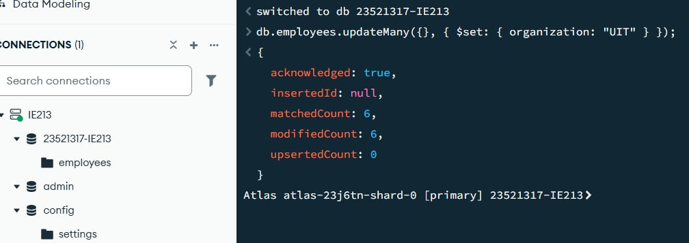
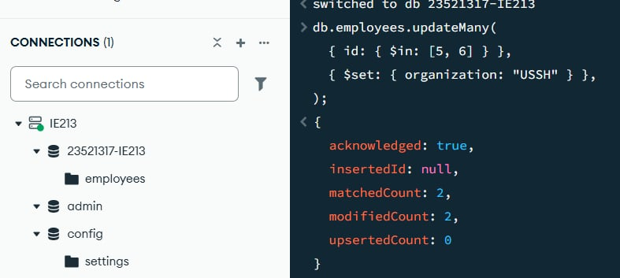
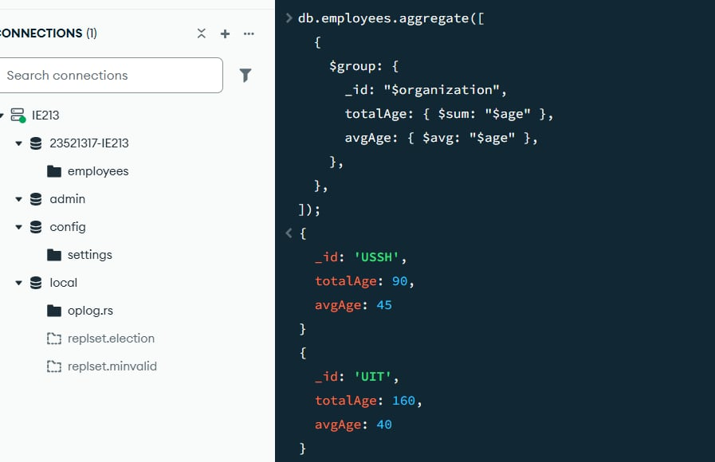

# LAB01 – MongoDB CRUD Operation

---

## Thông tin sinh viên

- Họ tên: Lê Văn Quý
- MSSV: 23521317
- Môn học: IE213.Q21 – Kỹ thuật phát triển hệ thống Web
- Lớp: IE213.Q21.2

---

## Mục tiêu

- Thiết lập và cấu hình MongoDB Atlas.
- Kết nối thông qua MongoDB Compass.
- Tạo cơ sở dữ liệu (database) và các bộ sưu tập (collection).
- Thực hiện các thao tác CRUD bằng mongosh.
- Thực hiện các câu lệnh truy vấn.

---

### Bài 1: Thiết lập môi trường



### Bài 2: MongoDB CRUD Operation

#### 2.1 Tạo database có tên MSSV-IE213 trên cluster



#### 2.2 Thêm các document vào collection employees

```javascript
db.employees.insertMany([
  { id: 1, name: { first: "John", last: "Doe" }, age: 48 },
  { id: 2, name: { first: "Jane", last: "Doe" }, age: 16 },
  { id: 3, name: { first: "Alice", last: "A" }, age: 32 },
  { id: 4, name: { first: "Bob", last: "B" }, age: 64 },
]);
```



#### 2.3 Tạo unique index cho trường id

```javascript
db.employees.createIndex({ id: 1 }, { unique: true });
```



#### 2.4 Tìm nhân viên John Doe

```javascript
db.employees.find({
  "name.first": "John",
  "name.last": "Doe",
});
```



#### 2.5 Tìm nhân viên có tuổi trên 30 và dưới 60

```javascript
db.employees.find({
  $and: [{ age: { $gt: 30 } }, { age: { $lt: 60 } }],
});
```



#### 2.6 Thêm document có middle name

```javascript
db.employees.insertMany([
  { id: 5, name: { first: "Rooney", middle: "K", last: "A" }, age: 30 },
  { id: 6, name: { first: "Ronaldo", middle: "T", last: "B" }, age: 60 },
]);
```

Tìm document có middle name:

```javascript
db.employees.find({
  "name.middle": { $exists: true },
});
```


#### 2.7 Xóa trường middle name

```javascript
db.employees.updateMany(
  { "name.middle": { $exists: true } },
  { $unset: { "name.middle": "" } }
);
```



#### 2.8 Thêm trường organization

```javascript
db.employees.updateMany({}, { $set: { organization: "UIT" } });
```



#### 2.9 Cập nhật organization của id 5 và 6

```javascript
db.employees.updateMany(
  { id: { $in: [5, 6] } },
  { $set: { organization: "USSH" } }
);
```



#### 2.10 Tính tổng tuổi và tuổi trung bình theo organization

```javascript
db.employees.aggregate([
  {
    $group: {
      _id: "$organization",
      totalAge: { $sum: "$age" },
      avgAge: { $avg: "$age" },
    },
  },
]);
```



---
