# LAB02 – Thiết lập Backend với NodeJS & ExpressJS

---

## Thông tin sinh viên

- Họ tên: Lê Văn Quý
- MSSV: 23521317
- Môn học: IE213.Q21 – Kỹ thuật phát triển hệ thống Web
- Lớp: IE213.Q21.2

---

## Mục tiêu

- Thiết lập môi trường NodeJS
- Khởi tạo server với ExpressJS
- Kết nối MongoDB Atlas
- Kiến trúc mã nguồn theo mô hình DAO – Controller – Route
- Xây dựng API /api/v1/movies để truy xuất dữ liệu movies

---

## Công cụ sử dụng

- NodeJS
- ExpressJS
- MongoDB Atlas
- MongoDB Compass
- VS Code

---

## Cấu trúc thư mục bài thực hành 2

```text
LAB02
├── movie-reviews/
│   └── backend/
│       ├── API/
│       │   ├── movies.controller.js
│       │   └── movies.route.js
│       ├── DAO/
│       │   └── moviesDAO.js
│       ├── node_modules/
│       ├── .env
│       ├── index.js
│       ├── package.json
│       ├── package-lock.json
│       └── server.js
├── Results/
└── Lab02.md
```

---

## Thực hiện

### Bài 1: Thiết lập môi trường

#### 1.1 Cài đặt nodejs

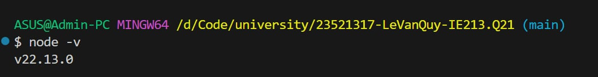

#### 1.2 Khởi tạo dự án

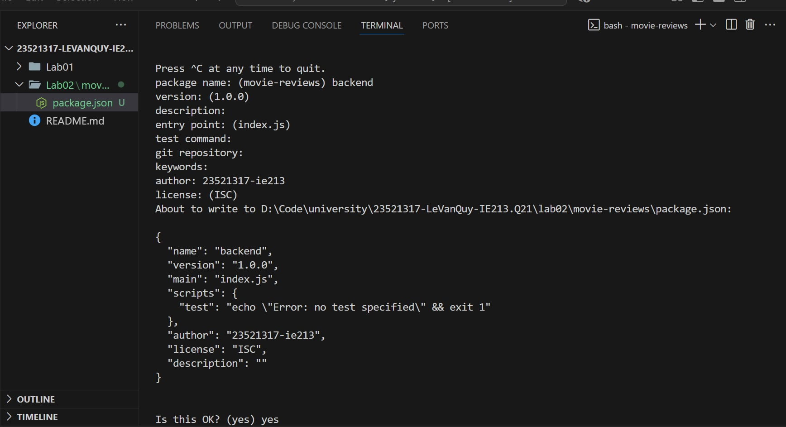

#### 1.3 Cài đặt một số dependency của dự án như mongodb, express, cors, dotenv.

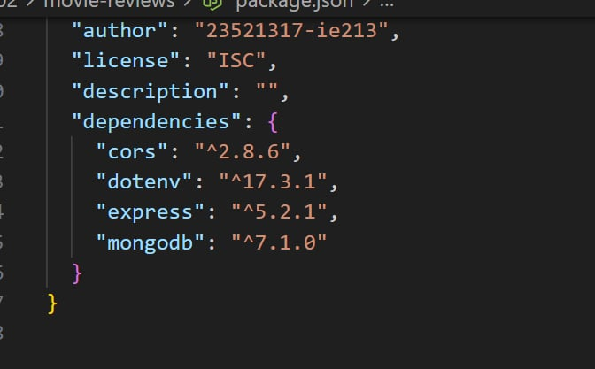

#### 1.4 Cài đặt nodemon

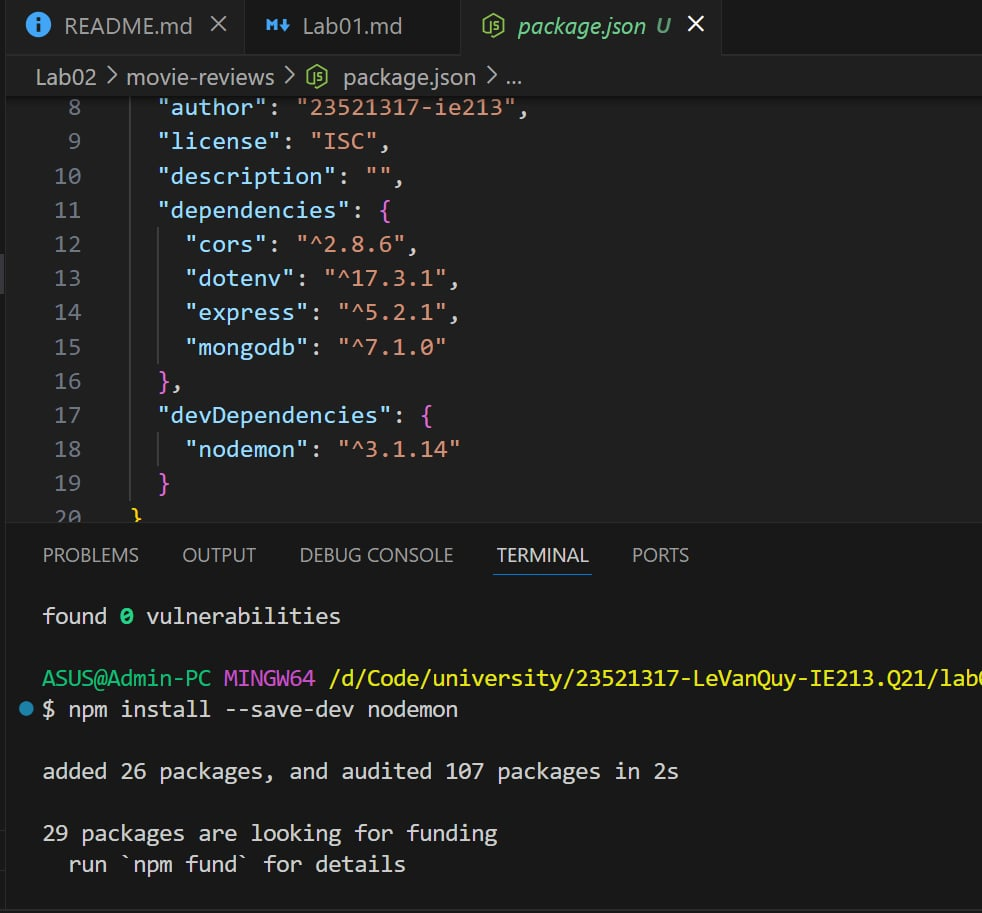

### Bài 2:

#### 2.1 Tạo tệp tin server.js là nơi khởi tạo máy chủ web (tệp này nằm trong thư mục backend).

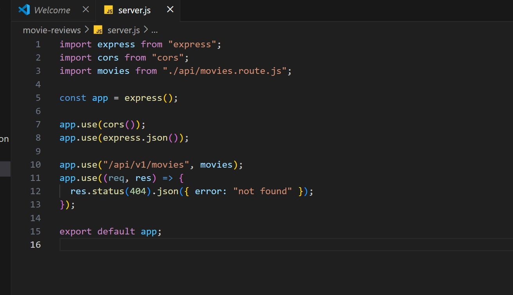

#### 2.2 Tạo tệp tin .env để lưu trữ thông tin biến môi trường phát triển như URI kết nối tới DB trên MongoDB Atlas, PORT dịch vụ web, ví dụ 3000.

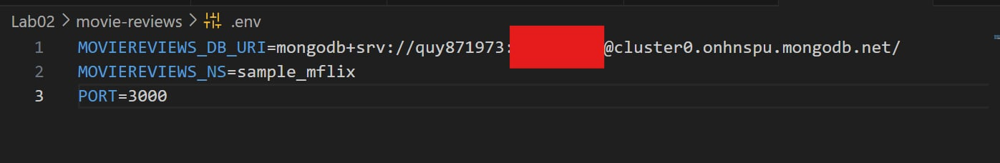

#### 2.3 Tạo tệp tin index.js để quản lý việc kết nối dữ liệu, khởi tạo đối tượng, và chạy máy chủ.

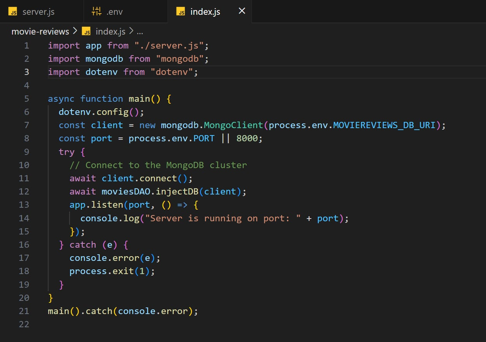

#### 2.4 Tạo thư mục và tệp tin tương ứng trong thư mục backend gồm api/movies.route.js để xử lý các định tuyến liên quan đến ứng dụng minh hoạ movies về sau.

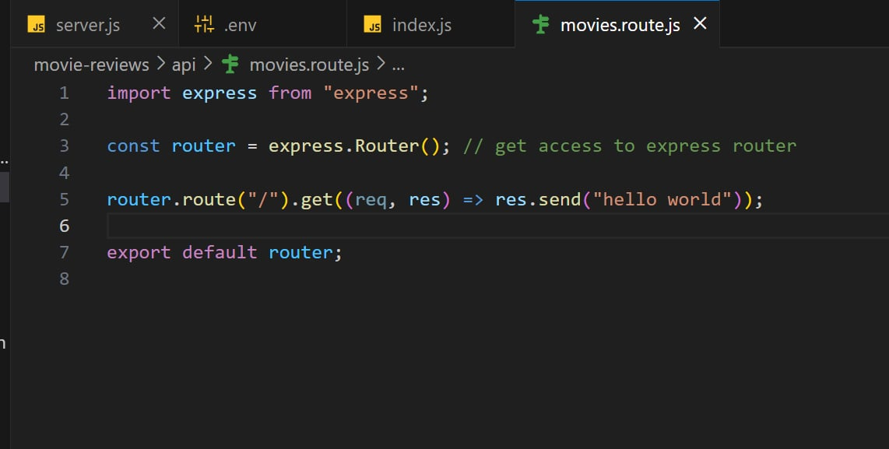

#### 2.5 Thiết lập công cụ truy xuất dữ liệu cho ứng dụng Movie với DAO – Data Access Object.

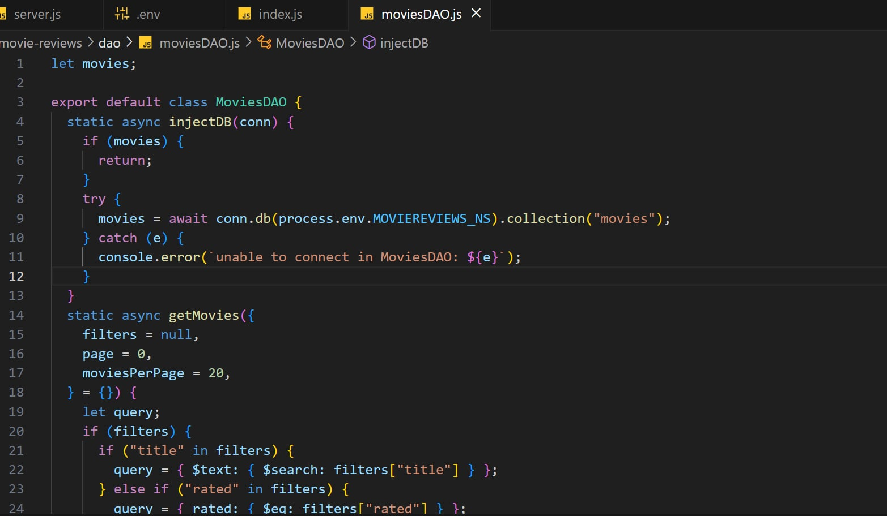

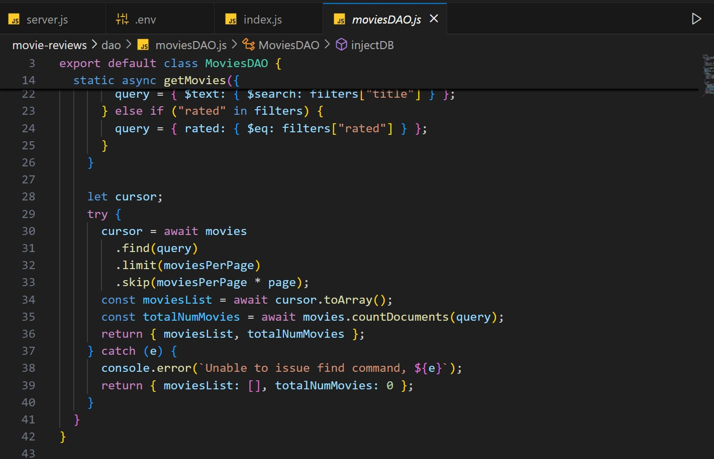

#### 2.6 Thiết lập CONTROLLER cho ứng dụng web để gọi tới DAO.

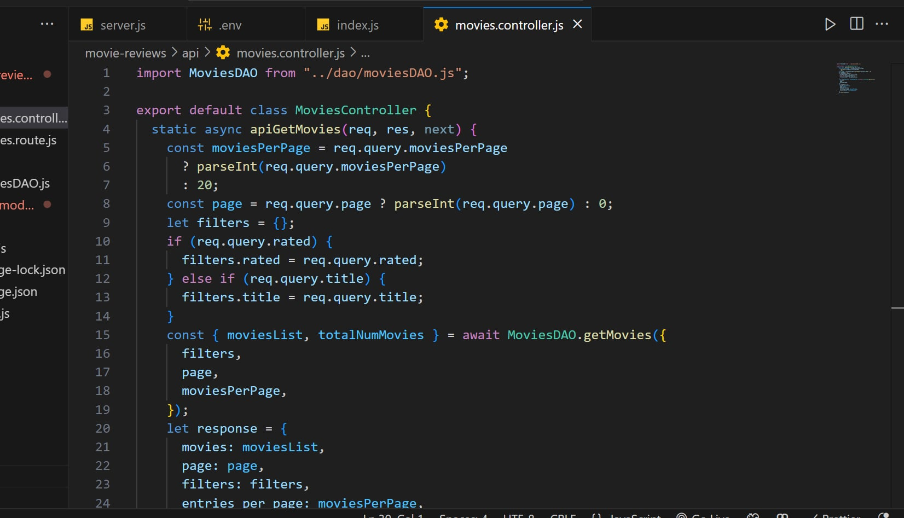

#### 2.7 Đưa Controller vừa tạo ở yêu cầu 2.6 vào định tuyến

- Đưa Controller vừa tạo ở yêu cầu 2.6 vào định tuyến

  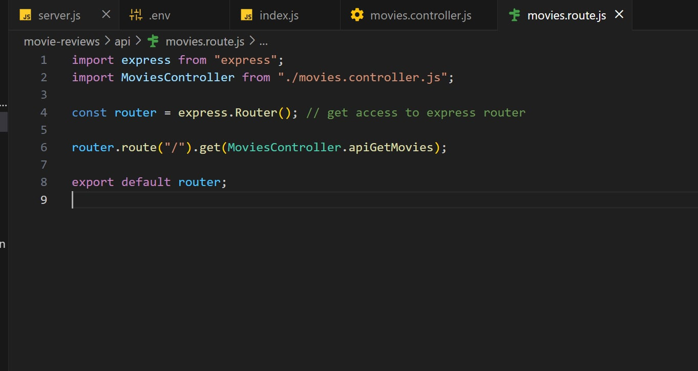

- Chạy lệnh npm start

  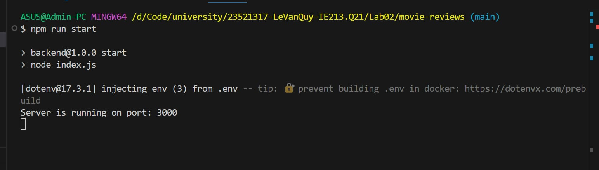

- Truy cập localhost:3000/api/v1/movies/

  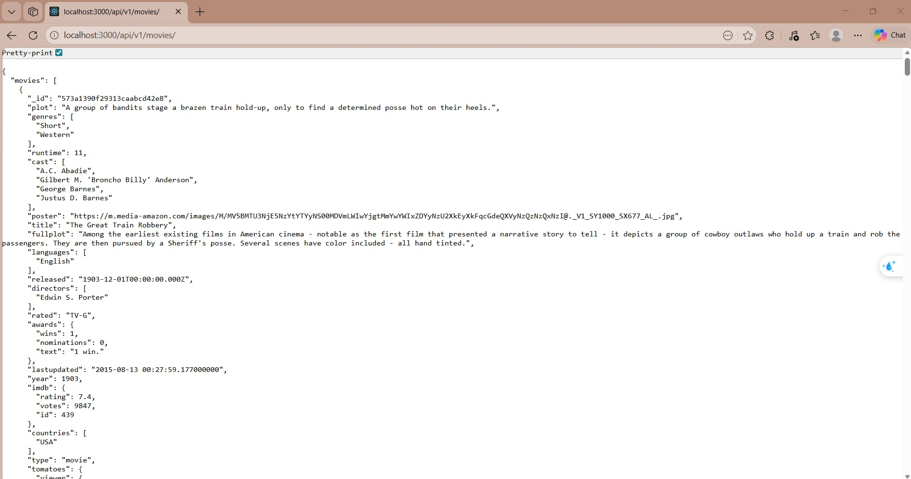
