# LAB03 – Hoàn thiện Backend cho ứng dụng minh họa

---

## Thông tin sinh viên

- Họ tên: Lê Văn Quý
- MSSV: 23521317
- Môn học: IE213.Q21 – Kỹ thuật phát triển hệ thống Web
- Lớp: IE213.Q21.2

---

## Mục tiêu

- Xây dựng chức năng Review cho ứng dụng
- Hoàn thiện backend với mô hình DAO – Controller – Route
- Thực hiện các thao tác CRUD cho review
- Xây dựng các API nâng cao cho movies

---

## Công cụ sử dụng

- NodeJS
- ExpressJS
- MongoDB Atlas
- MongoDB Compass
- VS Code
- Insomnia

---

## Cấu trúc thư mục bài thực hành 2

```text
LAB02
LAB03
├── movie-reviews/
│   └── backend/
│       ├── api/
│       │   ├── movies.controller.js
│       │   ├── movies.route.js
│       │   └── reviews.controller.js
│       ├── DAO/
│       │   ├── moviesDAO.js
│       │   └── reviewsDAO.js
│       ├── index.js
│       ├── server.js
│       └── package.json
├── screenshots/
└── Lab03.md
```

---

## Thực hiện

### Bài 1: Thiết lập định tuyến cho các thao tác với review (Post/Update/Delete)

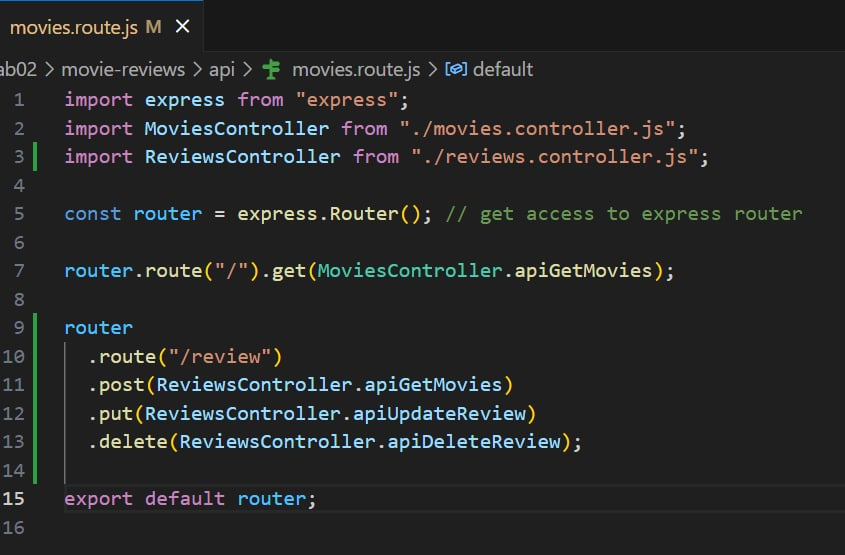

### Bài 2: Thiết lập Controller cho review.

### Bài 2.2:Trong tệp tin vừa tạo ở bài 2.1 sẽ chứa dòng lệnh import nội dung từ tệp tin reviewsDAO.js để gọi tới các hàm tương tác dữ liệu.

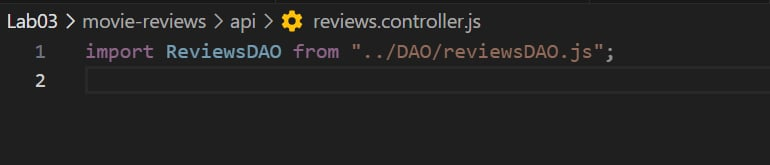

### Bài 2.3:Tạo phương thức có tên apiPostReview() để quản lý các yêu cầu được gửi từ máy khách

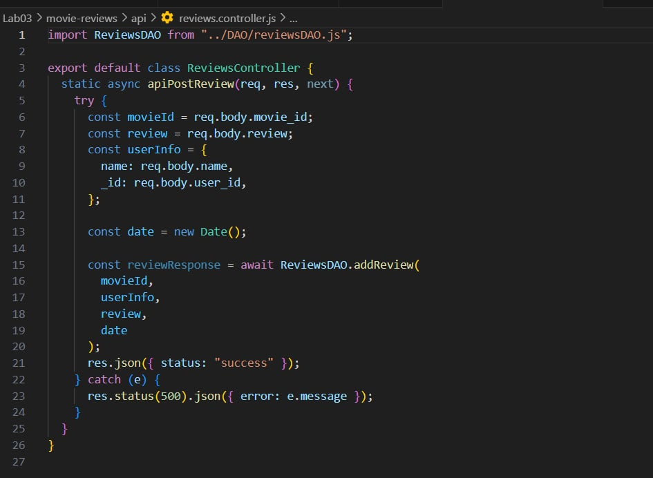

### Bài 2.4:Tạo phương thức có tên apiUpdateReview() để quản lý các yêu cầu được gửi từ máy khách

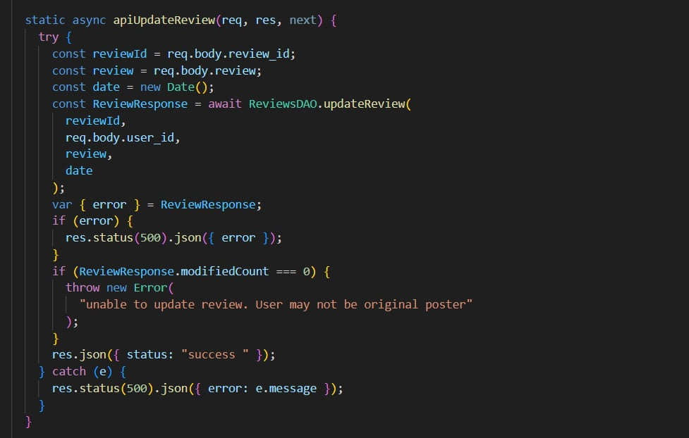

### Bài 2.5:Tạo phương thức có tên apiDeleteReview() để quản lý các yêu cầu được gửi từ máy khách

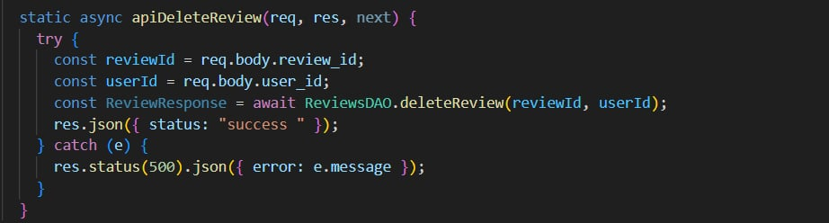

### Bài 3: Thiết lập DAO cho reviews.

#### Bài 3.2 Tạo phương thức có tên injectDB() giúp kết nối tới collection tương ứng trên db.

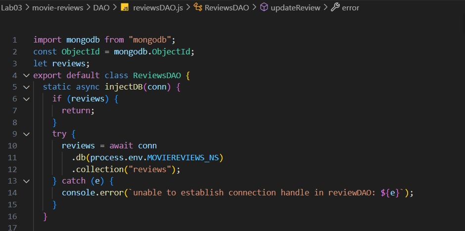

#### Bài 3.3 Tạo phương thức addReview() để thêm review vào db

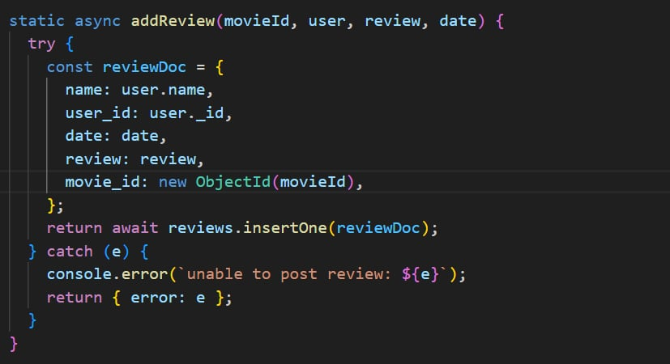

#### Bài 3.4 Tạo phương thức updateReview() để sửa review trên db

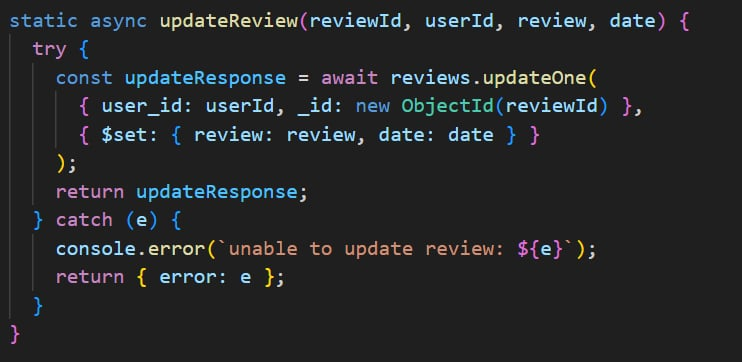

#### Bài 3.5 Tạo phương thức deleteReview() để thêm review vào db

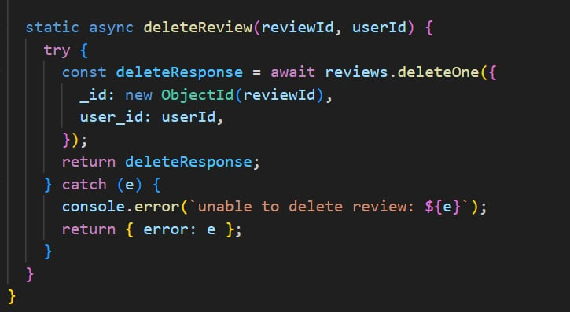

#### Bài 3.6 Thử nghiệm các API bằng phần mềm hỗ trợ Insomnia

POST

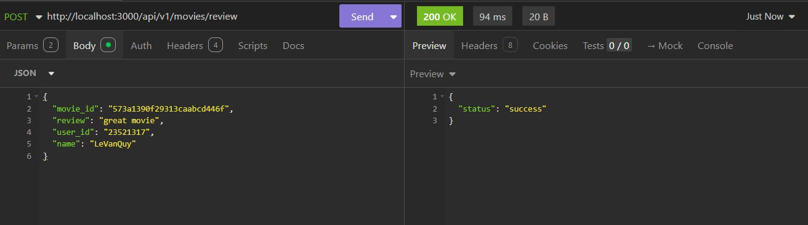

PUT

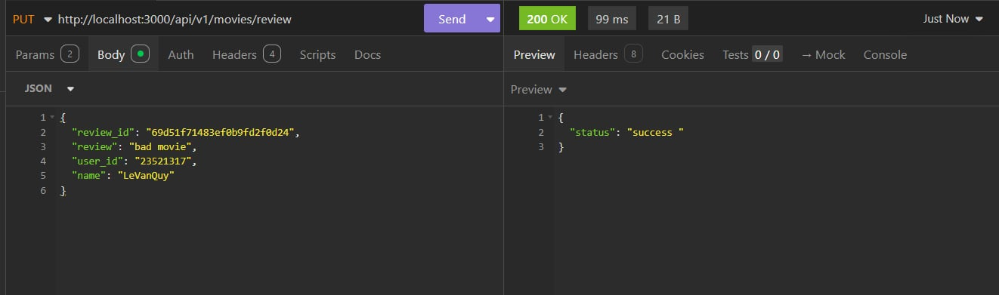

DELETE

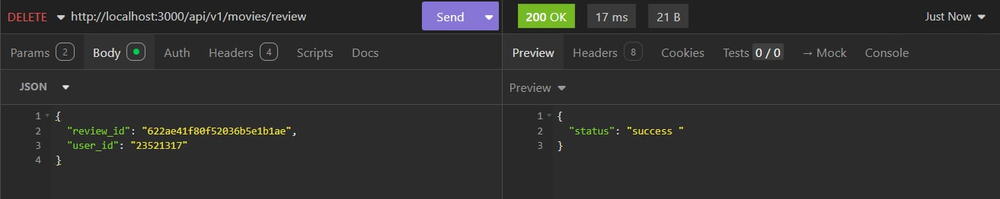

### Bài 4: Hoàn thành back-end cho ứng dụng minh họa.

#### Bài 4.1 Thêm 2 định tuyến

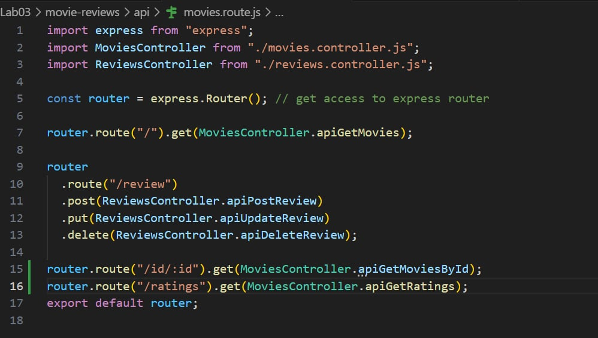

#### Bài 4.2 Thêm 2 phương thức apiGetMovieById() và apiGetRatings() trong movie controller.

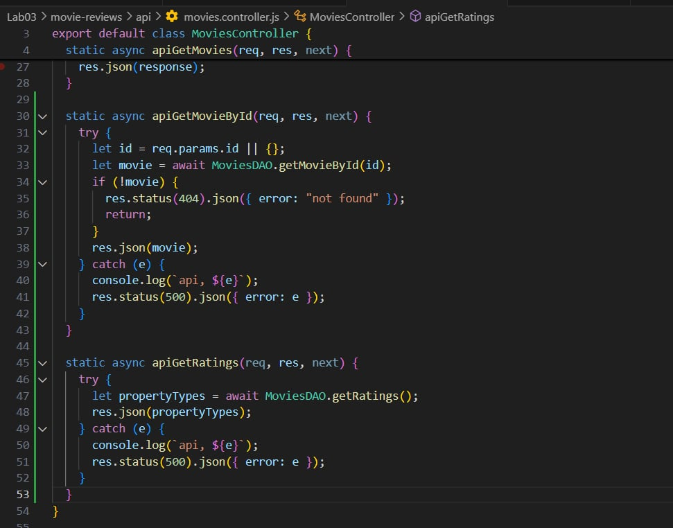

#### Bài 4.3 Thêm 2 phương thức DAO getRatings() và getMovieById() trong dao movie.

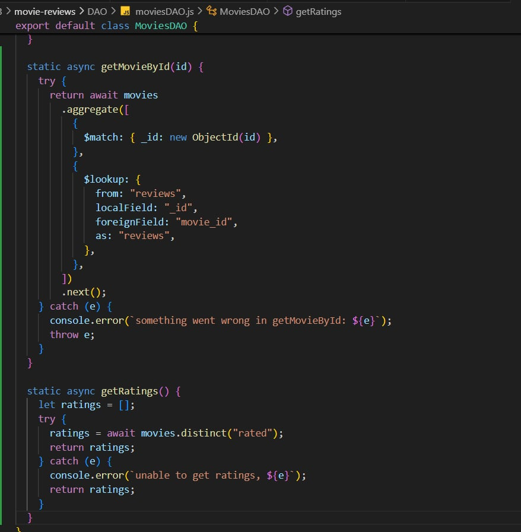

#### Bài 4.4 Thử nghiệm các API bằng phần mềm hỗ trợ Insomnia

ratings

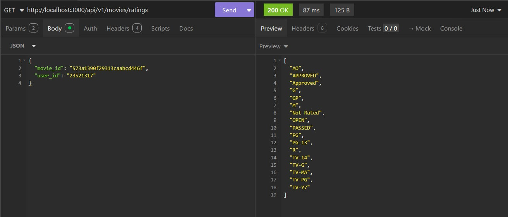

id

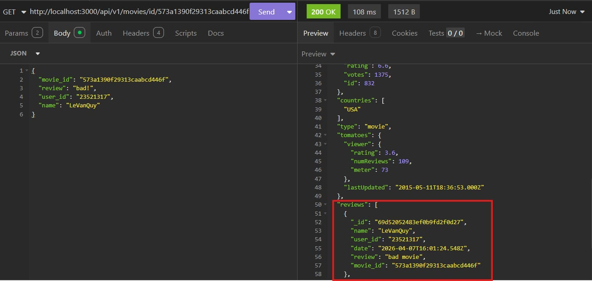
